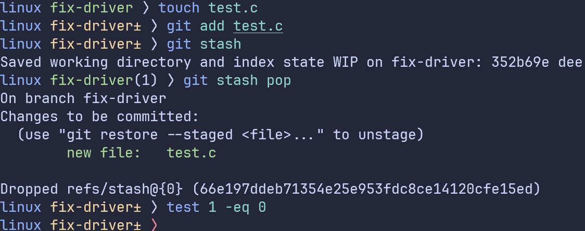

Very inspired from gnuykeaj.

# Features

- Asynchronous git status
- Number of git stash
- Git branch (shorten if too long)
- Show if git is dirty (uncommitted files)
- Purple ">" if rebase in progress
- Show current virtual env,
- Red ">" if last command failed
- Folder color can depend if symbolic link points to current folder (optional)

# Async

Git can be a big slow on huge monorepo sometimes. This is async
so it first show prompt without git infos then update the prompt.

Fish doesn't support async so it was non trivial and a bit hacky to implement. A mix of global variable and
signals between processes makes the whole thing work.

## Performances

The first render of the prompt (without git infos) takes 16 ms on my computer.

As it's asynchronous you can start typing after the first render.

The second render of the prompt (with git infos) takes place 55ms after the beginning (so 39 ms after the first prompt).

# License

[MIT][mit] © [ilan schemoul][author]

[mit]:            https://opensource.org/licenses/MIT
[author]:         https://github.com/{{USER}}
[contributors]:   https://github.com/{{USER}}/plugin-stellar-fish-prompt/graphs/contributors
[license-badge]:  https://img.shields.io/badge/license-MIT-007EC7.svg?style=flat-square
